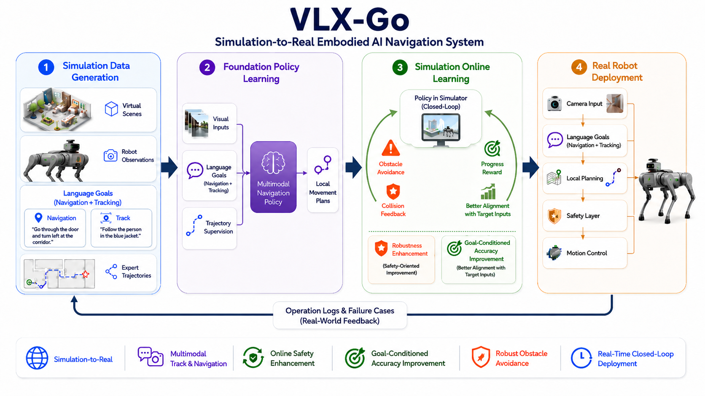

<p align="center">
  
</p>

<h1 align="center">VLX-Go</h1>

<h3 align="center">面向具身导航的视觉-语言短时航点预测模型</h3>

<p align="center">
  <a href="README.md">English</a> | 中文
</p>

<p align="center">
  <a href="https://x.com/OmAI_lab"></a>
  <a href="https://om-ai-lab.github.io/2026_06_28_vlx_go_zh.html"></a>
  <a href="#模型文件"></a>
  <a href="#数据集"></a>
  <a href="https://huggingface.co/blog/omlab/vlx-go"></a>
</p>

<p align="center"><sub>概览视频：VLX-Go 面向具身导航的视觉-语言短时航点预测。</sub></p>

https://github.com/user-attachments/assets/c00f1d8b-36c4-4fa6-805f-2775d206ad41

## 项目概览

<p align="center">
  
</p>

VLX-Go 是一个面向具身导航的轻量化视觉-语言航点规划模型。给定近期单目图像、当前观测和自然语言指令，它会预测未来短时间窗内的局部航点，并交由下游控制器在仿真或机器人系统中执行。

与依赖通用 VLM 描述场景或生成文本形式动作不同，VLX-Go 将视觉-语言状态直接映射到紧凑的航点接口。本仓库聚焦目标跟随、局部导航、动态避障和闭环评测。

VLX-Go 基于 [OmTrackVLA](https://github.com/om-ai-lab/OmTrackVLA) 的技术路线，并进一步延展到轻量化航点预测与闭环导航研究。

## 亮点

- **0.6B 航点规划器**：轻量化结构，面向更低推理成本和更方便的部署。
- **指令条件规划**：自然语言指令指定任务意图，包括跟随、到达和避障。
- **短时航点输出**：模型预测局部运动目标，而不是完整全局路径或纯文本响应。
- **时序视觉上下文**：利用近期帧捕捉目标运动、遮挡变化和场景动态。
- **闭环评测**：通过观测、预测、执行和反馈的循环评估导航能力。

## 任务定义

VLX-Go 在每个时间步解决滚动时域航点预测（receding-horizon waypoint prediction）问题。

**输入**

- 近期视觉历史：`H_t = {I_{t-k}, ..., I_{t-1}}`
- 当前图像：`I_t`
- 文本指令：`q`，例如 “follow the target person and avoid obstacles”

**输出**

- 短时间窗航点序列：`W_t = {w_1, ..., w_T}`

其中 `w_i` 表示局部运动目标，例如位置、朝向，或其他可由控制器直接使用的航点形式。具体维度由数据集和控制接口决定。

```text
history frames + current frame + instruction
                 |
                 v
        VLX-Go waypoint planner
                 |
                 v
       short-horizon waypoints -> controller / simulator
```

## 方法

VLX-Go 将航点规划与平台相关的底层控制解耦：规划器预测短时局部目标，下游控制器负责速度命令、安全约束和动力学约束。

| 阶段 | 说明 |
| --- | --- |
| 视觉编码 | 将当前帧和近期视觉历史编码为视觉特征 |
| 语言条件建模 | 将自然语言指令作为规划任务条件 |
| 航点预测 | 由 0.6B 规划器预测短时间窗内的局部运动目标 |
| 闭环执行 | 执行预测航点，收集下一帧观测，并预测下一段航点 |

这种滚动时域设计适合动态场景：目标会移动，障碍物可能进入视野，早先预测也可以通过新观测不断修正。

## 训练

VLX-Go 首先基于离线轨迹数据训练，随后可以利用在线仿真反馈进一步优化。

| 阶段 | 数据 / 信号 | 目标 |
| --- | --- | --- |
| 离线轨迹学习 | 演示轨迹、视频帧、语言指令 | 学习目标跟随和局部航点生成 |
| 在线优化 | 仿真反馈、碰撞信号、目标状态、奖励信号 | 提升对遮挡、障碍物和闭环漂移的鲁棒性 |

典型监督目标包括航点回归、轨迹方向损失、可选的速度或动作辅助损失，以及平滑正则项。在线阶段用于补充监督学习，让策略接触离线轨迹数据难以覆盖的实际执行反馈。

## 评测

VLX-Go 在 EVT-Bench 的 STT 任务上进行评估。

| 模型 | 参数量 | STT SR ↑ | STT TR ↑ | STT CR ↓ |
| --- | --- | ---: | ---: | ---: |
| TrackVLA | 7B | 85.1 | 78.6 | **1.65** |
| NavFoM | 7B | 85.0 | 80.5 | - |
| Qwen-RobotNav-4B | 4B | 77.4 | 90.0 | 6.4 |
| Qwen-RobotNav-8B | 8B | 78.6 | 89.7 | 5.7 |
| **VLX-Go** | **0.6B** | **85.42** | **94.08** | 6.55 |

**指标说明**：SR 表示任务成功率，TR 表示目标跟踪率，CR 表示碰撞率。VLX-Go 在 0.6B 参数规模下取得了较强的成功率和跟踪率。进一步降低碰撞率仍是重要方向，尤其需要结合仿真环境、奖励设计、控制器和安全约束共同优化。

## 模型文件

即将发布。

## 数据集

即将发布。

## 关注我们

关注 Om AI Lab 的 [X](https://x.com/OmAI_lab)，或扫描下方微信群二维码获取 VLX 更新并参与讨论。

<p align="left">
  
</p>
